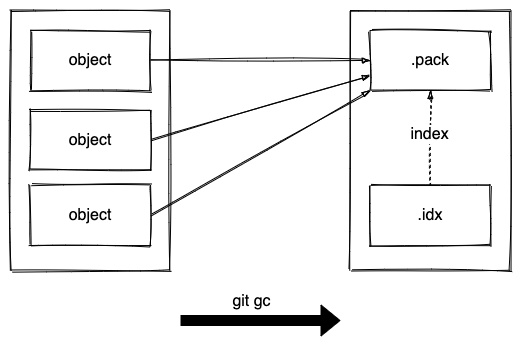

<!--
_class: lead
-->
# Under huven på Git
## En djupdykning i hur Git faktiskt fungerar
Anders Sigfridsson, Mars 2022

---
# Git är en databas

- Data lagras i en filstruktur och associeras med en unik nyckel
- Användaren skriver till och läser från databasen
- Data skickas och hämtas mellan en lokal och en (eller fler) avlägsen databas


---
<!-- 
_footer: Anpassad från: https://git-scm.com/book/en/v2/Getting-Started-What-is-Git%3F
-->
# Delta-baserad versionshantering

I t ex Subversion lagras varje fil en gång och därefter är varje version bara skillnader (deltan) mot den föregående


---
<!-- 
_footer: Anpassad från: https://git-scm.com/book/en/v2/Getting-Started-What-is-Git%3F
-->

# Versioner genom ögonblicksbilder

I Git är varje version en komplett filstruktur


---
# En graf med ögonblicksbilder

Från användarens synvinkel ser historiken i Git ut som en serie med ögonblicksbilder.


---
<!--
_class: lead
-->
# Filer och historik

---
# Porslin och rörmokeri

Förutom vanliga kommandon finns det ett antal sub-kommandon som verkar på interna datastrukturer


---
# I katalogen `.git`

Namn | Innehåll
---|---
**HEAD** | pekar (indirekt) på den ögonblicksbild som är i fokus
**config** | projekt-specifik konfiguration (inklusive `remotes`)
**index** | en magisk binär fil (dyker upp om en stund)
**objects/** | allt projektets innehåll kommer lagras här
**refs/** | innehåller pekare till saker i `objects`

---
<!-- 
_footer: Anpassad från: https://git-scm.com/book/en/v2/Git-Internals-Git-Objects
-->
# Data-klumpar och träd

Allt innehåll i Git lagras som data-klumpar (`blobs`) och träd (`trees`)


---
<!-- 
_footer: Anpassad från: https://git-scm.com/book/en/v2/Git-Internals-Git-Objects
-->
# Förbindelser (`commits`)

Historiken i Git får vi genom förbindelse-objekt (`commits`) knutna till träd och andra förbindelser


---
<!-- 
_footer: Anpassad från: https://git-scm.com/book/en/v2/Git-Internals-Git-References
-->
# Referenser och huvudet (`HEAD`)

Grenar i Git är pekare till sha1-summan av senast sparade förbindelsen som representerar en historik


---
# Porslin och rörmokeri igen

Vid `add`:
 - spara dataklump (`hash-object`)
 - uppdatera index-filen som är prepareringsytan (`update-index`)

Vid `commit`:
- skapa nytt träd från prepareringsytan (`write-tree`)
- skapa förbindelse som pekar på det nya trädet och eventuell föregående förbindelse (`commit-tree`)

---
<!--
_class: lead
-->
# Prepareringsytan

---
<!-- 
_footer: Anpassad från: https://git-scm.com/book/en/v2/Getting-Started-What-is-Git%3F
-->
# De 3 tillstånden

Från användarens synvinkel rör sig data mellan 3 olika ytor:


---
# Prepareringsytan ("index" eller "staging area")

- Prepareringsytan är en magisk fil i .git-katalogen som:
  - lagrar information för nästa träd (`tree`) som ska skrivas till databasen
  - håller reda på hur tillståndet i filytan och i databasen förhåller sig till varandra

---
# Ett smutsigt index

När en fil ändras i arbetsytan eller lagts till i databasen och ingen ny förbindelse (`commit`) har gjorts har vi ett smutsigt index


---
<!--
_class: lead
-->
# Optimerad lagring

---
# Hur objekten lagras

Alla objekt skrivs i filer som är komprimerade med `zlib` och har namn baserat på `sha1` av innehållet.


---
# Dilemat med små ändringar

Eftersom varje fil sparas i sin helhet (om än komprimerad) kommer även en liten ändring av en fil kräva onödigt mycket diskutrymme


---
# Lösa objekt och paketeringsfiler

Vid `git gc` så paketeras lösa objekt-filer i `objects/packs`:
- `.idx` - en fil som indexerar innehållet i pack-filen
- `.pack` - binär fil med alla objekten



---
<!--
_class: lead
-->
# Lokala och fjärran databaser

---
# Referenser till fjärran saker

- När vi lägger till andra databaser (`repos`) sparas information om dem i `.git/config`
- Under `refs/remotes` lagras referenser som håller reda på det senast kända tillståndet i fjärr-databasen


---
# Hur objekten skickas och hämtas

När vi talar om för Git att vi vill skicka eller hämta referenser (med en `refspec`) så räknar den ut vad som behöver överföras och skapar en paketeringsfil med detta.


---
<!--
_class: lead
-->
# Summering och avslut

---
# En mer detaljerad bild


---
# Jobba effektivt med Git

  Tänk att ni rör er mellan olika tillstånd av *hela* projektet (alltså de faktiskta filerna ni ser) och att vad ni vill göra är att få detta tillstånd som ni vill ha det - Git är bara ett verktyg för att göra detta!

---
# Vidare läsning

- "ProGit" av Scott Chacon & Ben Straub - https://git-scm.com/book/en/v2
- "Version Control with Git" (2nd edition) av Jon Loeliger & Matthew McCullough
- "Advanced Git: Graphs, Hashes, and Compression, Oh My!" av Matthew MCullough - https://www.youtube.com/watch?v=ig5E8CcdM9g 

---
<!--
_class: lead
-->

# Slut

---
<!--
_class: lead
-->

# Bonusmaterial

---
# Lärdomar

- Filer lagras i Git redan vid `add`, men träd och förbindelser mellanlagras i ett index (prepareringsytan)
- Med `diff` visas skillnaden mellan arbetsytan och prepareringsytan; med `diff --staged` (för gammalt `--cached`) visas skillnaderna mellan prepareringsytan och databasen
- Konceptuellt sett lagrar Git ögonblicksbilder men detta optimeras med delta-baserad paketering
- Git städar regelbundet genom att flytta lösa objekt till paketeringsfiler (men bara de som kan knytas till en förbindelse!)
- Objekt överförs mellan databaser
- Konfiguration och index överförs **inte** mellan databaser
- Referenser **synkroniseras** mellan databaser

---
# Skapa objekt med Python

```python
import os
import zlib
from hashlib import sha1

content = 'Lorem ipsum dolor\n'
header = f'blob {len(content.encode('utf-8'))}\0'

obj = header + content
sha = sha1(obj.encode('utf-8')).hexdigest()
compressed_obj = zlib.compress(obj.encode('utf-8'))

path = f'.git/objects/{sha[0:2]}/{sha[2:]}'
os.makedirs(os.path.dirname(path))
with open(path, 'wb') as f:
    f.write(compressed_obj)
```

---
# Märken (`tags`)

- Märken (`refs/tags`) är referenser som pekar till commits (oftast)
- Det är som en gren (`refs/heads`) men flyttas inte automatiskt
- Det finns två typer:
  - lättviktigt märke (`lightweight tag`) - endast en referens
  - kommenterat märke (`annotated tag`) - ett eget objekt

---
# Hur Git håller reda på konflikter

- `.git/MERGE_HEAD` innehåller sha1-summan av förbindelsen som mergas in
- I förberedelseytan (`index`) lägger Git 3 versioner av en fil som innehåller konflikter:
  - 1 - sammanslagningsbasen (`merge base`)
  - 2 - "vår" version
  - 3 - "deras" version
- En version av filen med alla konflikter markerade lagras i filytan (finns *inte* i förberedelseytan eller databasen)


---
# Hitta borttappad data

- Det är väldigt ovanligt att data faktiskt försvinner under normalt arbete i Git eftersom objekt bara städas vid `gc`
- Två bra sätt att hitta förbindelser som blivit dolda:
  - `refspec` - visar lokal historik över alla åtgärder som skedd med referenser
  - `fsck --full` - visar bl a objekt som hamnat utanför grafen (`dangling objects`)
